# Architecture Overview

This document provides a detailed technical overview of the notienenombre.com website architecture.

<div align="center">
  
</div>

## High-Level Architecture

```mermaid
graph TB
    User[👤 User Browser] --> CDN[🌐 Azure SWA CDN/Edge]
    CDN --> Static[📦 Static Assets]
    
    subgraph "Build Process"
        RSS[📡 RSS Feed] --> Script[🔄 fetch-rss.mjs]
        Script --> Content[📄 Content Files]
        Content --> Build[⚙️ Vite Build]
        Build --> Dist[📁 dist/]
    end
    
    subgraph "Source Code"
        Src[📂 src/] --> Components[🧩 React Components]
        Src --> Hooks[🪝 Custom Hooks]
        Src --> Lib[📚 Libraries & Types]
        Public[📂 public/] --> Icons[🎨 PWA Icons]
        Public --> Manifest[📋 manifest.json]
    end
    
    Components --> Build
    Hooks --> Build
    Lib --> Build
    Icons --> Build
    Manifest --> Build
    
    Static --> Dist
    Dist --> CDN
```



## Content Flow


### Runtime Data Path (Episodes)

At runtime, the app prefers live data and falls back to a local snapshot for resilience:


Notes:

- Live RSS fetch uses a network-first strategy with `cache: no-store` to avoid stale caches.
- A scheduled GitHub Action refreshes `public/episodes.json` and `public/episodes.xml` daily at 03:00 UTC, commits changes, and triggers an Azure SWA deploy.

## Component Architecture

### Core Components

```text
src/components/
├── ui/                 # Reusable UI components (Radix-based)
│   ├── Button/
│   ├── Card/
│   ├── Dialog/
│   └── ...
├── layout/            # Layout components
│   ├── Header/
│   ├── Footer/
│   └── Navigation/
├── features/          # Feature-specific components
│   ├── Episodes/
│   ├── Player/
│   └── Search/
└── pages/            # Page-level components
    ├── Home/
    ├── Episode/
    └── About/
```

### Hooks Architecture

```text
src/hooks/
├── useEpisodes.ts     # Episode data management
├── usePlayer.ts       # Audio player state
├── useTheme.ts        # Theme switching
└── useLocalStorage.ts # Persistent state
```

### Libraries and Types

```text
src/lib/
├── types/            # TypeScript type definitions
│   ├── episode.ts
│   ├── player.ts
│   └── index.ts
├── utils/            # Utility functions
│   ├── formatters.ts
│   ├── validators.ts
│   └── helpers.ts
└── constants/        # Application constants
    ├── config.ts
    ├── routes.ts
    └── themes.ts
```

## Styling Architecture

### Tailwind CSS Setup

- **Framework**: Tailwind CSS 4.x with PostCSS integration
- **Configuration**: `tailwind.config.js` with custom design tokens
- **Components**: Radix UI primitives styled with Tailwind
- **Dark Mode**: System preference with manual override
- **Responsive Design**: Mobile-first approach with breakpoint utilities

### Design System

```text
styles/
├── globals.css       # Global styles and CSS variables
├── components.css    # Component-specific styles
└── utilities.css     # Custom utility classes
```

## Build Process

### Development Build

1. **Vite Dev Server** starts with HMR
2. **TypeScript** compilation in watch mode
3. **Tailwind CSS** processes styles with JIT
4. **React Fast Refresh** for component updates

### Production Build


### Build Steps Detail

1. **Pre-build**: `fetch-rss.mjs` downloads and processes RSS feed
2. **TypeScript**: Compile `.ts/.tsx` files with type checking
3. **Vite Bundle**: Tree-shake and bundle JavaScript modules
4. **CSS Processing**: Tailwind purging and optimization
5. **Asset Optimization**: Image compression, font subsetting
6. **PWA Generation**: Service worker and manifest creation

## Deployment Architecture

### Azure Static Web Apps

- **CDN**: Global edge distribution
- **Routing**: Client-side routing with fallback to index.html
- **Headers**: Security headers and caching policies
- **SSL**: Automatic HTTPS with custom domain support

### CI/CD Pipeline

```mermaid
graph TB
    PR[Pull Request] --> Test[🧪 Tests]
    Test --> Lighthouse[🔍 Lighthouse CI]
    Lighthouse --> Preview[👀 Preview Deploy]
    
    Main[Main Branch] --> Build[🔨 Build]
    Build --> Deploy[🚀 Deploy to Production]
    Deploy --> Monitor[📊 Monitoring]
```



## Performance Optimizations

### Bundle Optimization

- **Code Splitting**: Route-based and component-based splitting
- **Tree Shaking**: Dead code elimination
- **Minification**: JavaScript and CSS compression
- **Asset Optimization**: Image and font optimization

### Runtime Performance

- **React 19**: Concurrent features and improved rendering
- **Lazy Loading**: Component and image lazy loading
- **Caching**: Browser caching and service worker strategies
- **CDN**: Edge distribution for fast global access

### Lighthouse Metrics

Target scores:

- **Performance**: 95+
- **Accessibility**: 100
- **Best Practices**: 100
- **SEO**: 100

## PWA Features

### Service Worker

- **Caching Strategy**: Cache-first for static assets, network-first for data
- **Offline Support**: Basic offline functionality for cached content
- **Background Sync**: Update content when connection restored

### Manifest

- **Installation**: Add to home screen capability
- **Icons**: Multiple sizes for different devices
- **Theme Colors**: Consistent branding across platforms

## Security Considerations

### Content Security Policy

- **Script Sources**: Restrict to same-origin and trusted CDNs
- **Style Sources**: Inline styles with nonce, external stylesheets
- **Image Sources**: Data URIs and trusted domains only

### Data Handling

- **No User Data**: Stateless architecture with no user accounts
- **RSS Processing**: Server-side processing to avoid XSS
- **Client Storage**: Minimal localStorage usage for preferences

## Monitoring and Analytics

### Performance Monitoring

- **Lighthouse CI**: Automated performance testing
- **Core Web Vitals**: Monitoring real user metrics
- **Bundle Analysis**: Track bundle size over time

### Error Tracking

- **Error Boundaries**: React error boundary implementation
- **Console Monitoring**: Development-time error detection
- **Client-side Logging**: Minimal error reporting

## Accessibility

### WCAG Compliance

- **Semantic HTML**: Proper heading hierarchy and landmarks
- **Keyboard Navigation**: Full keyboard accessibility
- **Screen Reader Support**: ARIA labels and descriptions
- **Color Contrast**: WCAG AA compliant color ratios

### Testing

- **Automated Testing**: Lighthouse accessibility audit
- **Manual Testing**: Screen reader and keyboard testing
- **Color Blind Testing**: Color contrast validation

## Future Architecture Considerations

### Scalability

- **Static Generation**: Continue with JAMstack approach
- **Edge Computing**: Potential Vercel Edge Functions migration
- **CDN Optimization**: Advanced caching strategies

### Performance

- **Image Optimization**: WebP/AVIF format adoption
- **Font Loading**: Variable font implementation
- **Critical CSS**: Above-the-fold optimization

### Features

- **Search**: Client-side search implementation
- **Analytics**: Privacy-focused analytics integration
- **Internationalization**: Multi-language support architecture
