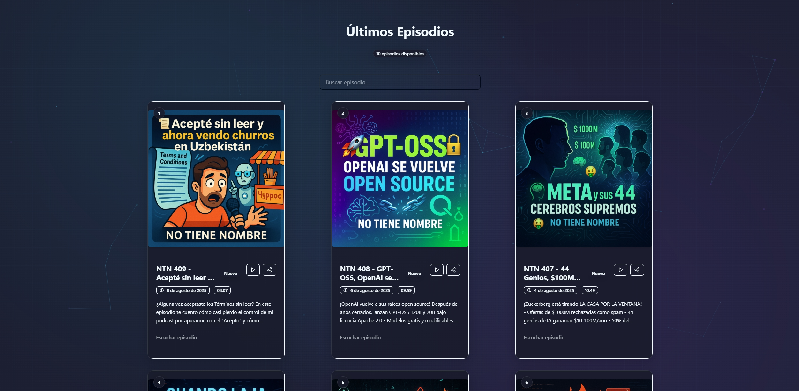

# notienenombre.com

<div align="center">
  
</div>

[](https://github.com/elbruno/no-tiene-nombre-podc/actions/workflows/azure-static-web-apps-kind-sky-0b305f010.yml)
[](https://github.com/elbruno/no-tiene-nombre-podc/actions/workflows/lighthouse-ci.yml)
[](https://github.com/elbruno/no-tiene-nombre-podc/blob/main/.github/dependabot.yml)
[](LICENSE)

This repository powers the main page of [notienenombre.com](https://notienenombre.com).

## History

- **Initial scaffold using Spark** - Project bootstrapped with GitHub's Spark template for rapid development
- **Refinements via GitHub Copilot with GPT-5 using Beast-Mode**
  - Enhanced with AI-powered development using [Beast-Mode 4.1](.github/chatmodes/beast-mode-4.1.chatmode.md)
  - External reference: [GitHub Awesome Copilot Beast Mode](https://github.com/github/awesome-copilot/blob/main/chatmodes/4.1-Beast.chatmode.md)
- **Automated deployment via Azure Static Web Apps (SWA) GitHub Action** - Continuous deployment pipeline established

## Goals and Non-Goals

### Goals

- **Fast, accessible podcast website** - Optimized performance and accessibility for all users
- **Modern web standards** - PWA capabilities, responsive design, semantic HTML
- **Automated content pipeline** - RSS feed integration with prebuild content fetching
- **CI/CD best practices** - Automated testing, deployment, and monitoring
- **Developer experience** - Clear documentation, easy local development, automated tooling

### Non-Goals

- **Content management system** - Static site generation focused on performance
- **User authentication** - Public-facing content only
- **Complex interactivity** - Simple, fast browsing experience prioritized
- **Multi-language support** - Single language implementation (though i18n is on the roadmap)

## Architecture Overview

### Stack

- **Framework**: React 19 with TypeScript
- **Build Tool**: Vite 6.x
- **Styling**: Tailwind CSS 4.x with custom design system
- **Deployment**: Azure Static Web Apps
- **CI/CD**: GitHub Actions

### Key Folders

```text
src/                     # Application source code
├── components/          # React components
├── hooks/              # Custom React hooks
├── lib/                # Utility libraries and types
└── styles/             # CSS and styling files

scripts/
└── fetch-rss.mjs       # Content pipeline (runs in prebuild)

public/                  # Static assets
├── icons/              # PWA icons and favicons
├── manifest.json       # PWA manifest
├── robots.txt          # SEO configuration
└── sitemap.xml         # Search engine sitemap

dist/                   # Build output (generated)
```

### Build Output

- **Static Assets**: Generated to `dist/` directory
- **PWA Features**: Service worker, manifest, offline capabilities
- **Optimized Bundle**: Tree-shaken, minified production build

## CI/CD Overview

### Workflows

- **[Azure SWA Deploy](.github/workflows/azure-static-web-apps-kind-sky-0b305f010.yml)** - Automatic deployment on push to main
- **[Lighthouse CI](.github/workflows/lighthouse-ci.yml)** - Performance and accessibility testing
- **[RSS Snapshot](.github/workflows/rss-snapshot.yml)** - Content pipeline automation; runs daily at 03:00 UTC to refresh `public/episodes.json` and `public/episodes.xml` and trigger a deploy

### Deployment Pipeline

1. Code pushed to `main` branch
2. GitHub Actions triggers build process
3. RSS content fetched and processed
4. Vite builds optimized static assets
5. Azure SWA deploys to global CDN
6. Lighthouse CI validates performance

## Episode Data Freshness

The site prioritizes live data while remaining resilient offline:

- **Runtime (primary path)**: The client fetches the live RSS feed on every load using a network-first strategy with `cache: 'no-store'` so new episodes appear promptly.
- **Fallback**: If the live RSS fetch fails (e.g., CORS or provider outage), the app falls back to the local snapshot at `/episodes.json`.
- **Daily snapshot**: A GitHub Action updates `/public/episodes.json` and `/public/episodes.xml` daily at 03:00 UTC, committing changes to the repo which triggers a new Azure SWA deploy. This keeps the fallback fresh even if the provider is temporarily unavailable.

References:

- Live feed URL is configured in [`src/lib/podcast-config.json`](src/lib/podcast-config.json)
- Fallback snapshot lives at [`public/episodes.json`](public/episodes.json)

## Screenshots


*Homepage with episode listings*


*Episode detail view*

> Screenshots are automatically generated using Playwright. See [docs/screenshots/](docs/screenshots/) for all available images.

## Local Development

### Prerequisites

- Node.js LTS (see [.nvmrc](.nvmrc) for exact version)
- npm (comes with Node.js)

### Getting Started

```bash
# Install dependencies
npm install

# Start development server
npm run dev

# Build for production
npm run build

# Preview production build
npm run preview

# Generate screenshots
npm run screenshots
```

### Available Scripts

- `npm run dev` - Start development server on <http://localhost:5173>
- `npm run build` - Build for production (includes RSS fetch prebuild step)
- `npm run preview` - Preview production build locally
- `npm run lint` - Run ESLint for code quality
- `npm run screenshots` - Generate screenshots using Playwright

## Deployment

### Azure Static Web Apps

Deployment is automated via GitHub Actions. The following secret is required:

- `AZURE_STATIC_WEB_APPS_API_TOKEN_KIND_SKY_0B305F010` - Azure SWA deployment token

### Manual Deployment

```bash
npm run build
# Upload dist/ folder to your static hosting provider
```

## Performance and Accessibility

This project maintains high performance and accessibility standards:

- **Lighthouse CI**: Automated testing on every PR
- **Core Web Vitals**: Optimized for Google's performance metrics
- **Accessibility**: WCAG 2.1 AA compliance
- **PWA**: Progressive Web App capabilities

[](https://github.com/elbruno/no-tiene-nombre-podc/actions/workflows/lighthouse-ci.yml)

## Prompting & AI Workflow

This project leverages GitHub Copilot with GPT-5 in Beast-Mode for enhanced development:

- **Beast-Mode Configuration**: [.github/chatmodes/beast-mode-4.1.chatmode.md](.github/chatmodes/beast-mode-4.1.chatmode.md)
- **AI-Assisted Refactoring**: Code quality improvements and optimization
- **Prompt Engineering**: Structured prompts for consistent AI assistance
- **Documentation Generation**: AI-powered documentation updates

## Documentation

- [Architecture Overview](ARCHITECTURE.md) - Detailed technical architecture
- [Development History](HISTORY.md) - Project timeline and milestones
- [Changelog](CHANGELOG.md) - Version history and changes
- [Roadmap](ROADMAP.md) - Future development plans
- [Contributing Guidelines](CONTRIBUTING.md) - How to contribute
- [Code of Conduct](CODE_OF_CONDUCT.md) - Community standards

## Contributing

Want to help? Quick start:

- Fork the repo and create a feature branch from `main`
- Install and run locally: `npm install` then `npm run dev`
- Before opening a PR: `npm run lint` and `npm run build` (and `npm run screenshots` if the UI changed)
- Open a PR using the template and include screenshots for UI changes

See CONTRIBUTING.md for the full guide.

## License and Security

- **License**: [MIT License](LICENSE)
- **Security**: See [SECURITY.md](SECURITY.md) for security policies and reporting
- **Code Ownership**: See [.github/CODEOWNERS](.github/CODEOWNERS) for maintainer information

---

Built with ❤️ using React, Vite, and Tailwind CSS. Deployed on Azure Static Web Apps.
